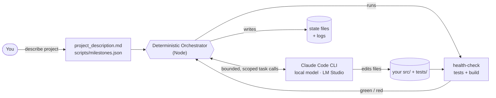
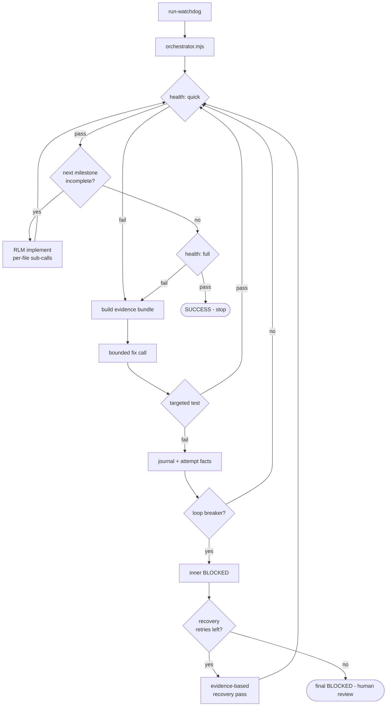
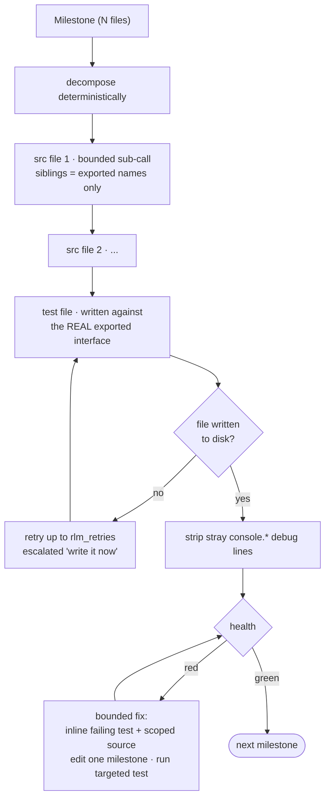

<div align="center">

# Claude Local — Autonomous Watchdog for Local LLMs

**Let a small, local model build and self-heal a whole project — for hours, unattended, without spiraling.**

[](https://nodejs.org)
[](https://code.claude.com)
[](https://lmstudio.ai)
[](#-rlm-recursive-build)
[](#license)

</div>

---

## What is this?

A drop-in kit that runs the **Claude Code CLI** autonomously on **small / local LLMs** (e.g. LM Studio) to build a project milestone-by-milestone and self-heal on failures.

The trick: the control loop lives in **deterministic Node code, not in model judgment**. The model is only ever asked for **one small, scoped task at a time** — implement a single file, or fix a single failing test — with a tight turn cap, exactly-the-context-it-needs inline, and hard stop conditions. A weak model can't spiral into re-reading files, repeating dead fixes, or running until a human kills it.

> **Result:** under the RLM-integrated kit, a **9B local model** (LM Studio) that previously stalled at milestone 3 autonomously built a full **5-milestone ABS brake simulator** — physics, dynamics, ABS controllers, scenario simulation, and telemetry — verified green by `health:full` (**94 tests, 0 failures**).

---

## Highlights

- **Deterministic orchestration.** Health checks, milestone selection, verification, and stop conditions are all code — the model never decides when to stop or that work is "done".
- **RLM recursive build.** Milestones are decomposed into **bounded per-file sub-calls**; fixes inline only the failing test + scoped source. ([details](#-rlm-recursive-build))
- **Anti-spiral loop breakers.** Same-error, no-edit, no-progress, and max-turn guards force a safe STOP — then a broader **recovery pass** retries.
- **Evidence-first prompts.** Each fix call gets a compact bundle: first failing test, assertion shape, scope, imports, and prior root-cause analyses.
- **Self-documenting runs.** Concise terminal summaries while running; full transcripts in `logs/`.
- **One command.** `./run-watchdog.ps1` (Windows) or `./run-watchdog.sh` (Linux/macOS).

---

## Architecture at a glance



| Layer | Role |
|-------|------|
| `project_description.md` | Your vision, milestones, and tuning knobs (YAML frontmatter) |
| `scripts/milestones.json` | Machine-checkable list of files per milestone ("done" detection) |
| `scripts/orchestrator/` | Inner loop: health, milestones, RLM build, loop-breakers |
| `scripts/orchestrator/great-loop.mjs` | Outer loop: recovery passes when the inner loop BLOCKs (default 5×) |
| `scripts/orchestrator/rlm*.mjs` | RLM recursive per-file implement + bounded fix |
| `scripts/orchestrator/evidence.mjs` | Compact bundle: failing test, diagnostics, imports, scope |
| `scripts/diagnose-failure.mjs` | Failure microscope — deterministic first-failure diagnostics |
| `run-watchdog.ps1` / `.sh` | One-command launcher (Windows / Linux) |
| `watchdog.md` · `CLAUDE.md` | Anti-loop rules + project memory loaded each session |

---

## The autonomous loop



---

## Why this exists

Small local models, left to drive their own loop, tend to:

- re-read the same files many times,
- repeat the same dead fix,
- never decide when work is "done",
- claim tests pass without observing a green command,
- and spin until a human kills the session.

This kit separates **orchestration** (deterministic Node) from **execution** (the model). The orchestrator runs health checks, builds evidence for the active failure, picks the next milestone, invokes the model briefly, **verifies results itself**, and **stops safely** when progress stalls.

---

## RLM recursive build

> Inspired by **Recursive Language Models** (Zhang, Kraska, Khattab — [arXiv:2512.24601](https://arxiv.org/abs/2512.24601)).

**Core idea:** don't hand a model one big task with a big context. Treat the orchestrator as the *environment*, keep every model call **small and bounded**, give it **exactly the context it needs inline**, and decompose the work into **focused recursive sub-calls** that the deterministic code stitches together.



**What changes** (the health / loop-breaker / recovery machinery is otherwise unchanged, and the whole feature is reversible with `rlm_enabled: false`):

| Phase | Before | With RLM |
|-------|--------|----------|
| **Implement** | one agent call builds every milestone file → small models max out turns | one bounded sub-call **per file**; source first (dependency order), test last against the real interface; MISSING files retried |
| **Fix** | broad prompt + scope → model re-reads and wanders | bounded prompt that **inlines the failing test + scoped source**, edits one milestone's source, runs only the targeted test |
| **Hygiene** | model leaves debug `console.*` lines | stray single-line `console.*` stripped deterministically |

Sub-calls receive siblings as **symbolic handles** (exported symbol names only, never full file content) — the RLM "bounded context" principle applied to code generation. Integration milestones additionally expose prior-milestone source exports as the available API (`rlm_max_depth`).

---

## Quick start

### Prerequisites

- [Node.js](https://nodejs.org) 18+
- [Claude Code CLI](https://code.claude.com) configured for your local model (e.g. point `ANTHROPIC_BASE_URL` at LM Studio)

### 1 · Copy the kit into your project

Clone this repo or drop the kit files into your project root. If you already have a `package.json`, merge the `test` / `health` / `health:full` scripts instead of overwriting.

### 2 · Describe your project

Edit **`project_description.md`** (vision + milestones + frontmatter config) and **`scripts/milestones.json`** (the exact files each milestone must produce).

> **Tip for local models:** prefer **pure-logic modules** with Node tests (no DOM/browser). Put assertions inside `it()` / `test()` blocks, never directly in a `describe()` body.

### 3 · Run

```powershell
# Windows
.\run-watchdog.ps1
```

```bash
# Linux / macOS
chmod +x run-watchdog.sh
./run-watchdog.sh
```

The orchestrator builds milestones one at a time, self-heals on test failures, and stops with **SUCCESS** when all milestones exist and `npm run health:full` is green.

| Launcher mode | What it does |
|---------------|--------------|
| `run-watchdog` (no args) | Autonomous: build + self-heal until done or blocked |
| `-Test` / `--test` | One health check only (verify setup) |
| `-Interactive` / `--interactive` | Open a normal interactive Claude Code session |

---

## Configuration knobs

All knobs live in the YAML frontmatter of `project_description.md`.

```yaml
# --- turn budgets ---
impl_turns: 12            # legacy single-call implement budget (when rlm_enabled: false)
fix_turns: 8              # max turns per fix attempt
integration_fix_turns: 24
integration_recovery_turns: 32
recovery_turns: 20        # turn budget per recovery pass (broader than fix_turns)

# --- loop breakers (anti-spiral) ---
same_error_limit: 2       # stop after N identical error fingerprints
stall_limit: 2            # stop if the model edits nothing but the error persists
impl_attempt_limit: 3     # stop if a milestone gains no new files
max_turn_limit: 2         # stop/recover if the agent repeatedly hits max turns
max_iterations: 40        # hard ceiling on total loop cycles
great_loop_retries: 5     # max consecutive hangs at the SAME stage (resets on progress)

# --- RLM recursive build ---
rlm_enabled: true         # false restores the legacy single-call implement/fix
rlm_impl_turns: 8         # per source-file sub-call budget
rlm_test_turns: 10        # per test-file sub-call budget
rlm_retries: 2            # retry a sub-call file that ends up MISSING
rlm_max_depth: 1          # integration milestones expose prior src exports as API

# --- optional graph + diagnostics ---
graph_auto: true
graph_required: false
graph_scope_threshold: 3
graph_prompt_facts: 8
graph_query_timeout_ms: 15000
diagnostic_probe_timeout_ms: 5000
```

---

## How it stays safe with weak models

Loop breakers are enforced **in code** — the model does not decide when to stop:

| Trigger | Config key | Default |
|---------|------------|---------|
| Same error fingerprint twice in a row | `same_error_limit` | 2 |
| Model edits no files, error persists | `stall_limit` | 2 |
| Milestone gains no new files | `impl_attempt_limit` | 3 |
| Agent hits max turns repeatedly | `max_turn_limit` | 2 |
| Total cycles exceeded | `max_iterations` | 40 |

On **BLOCKED**, the orchestrator writes `failed_attempts.log`, records completed root-cause analyses in `failure_journal.log`, and reusable patterns in `learned_skills.log`. On **SUCCESS**, the transient state files are deleted.

### Reliability-first fix contract

Every fix/recovery prompt requires this structure, and the model is forbidden from claiming success unless command output in that same run is green — the orchestrator then **verifies independently** (targeted test, then health):

```text
READ:    files inspected, invariant understood
PATCH:   files changed, why each addresses the first failure
VERIFY:  targeted command run + observed result
LEARN:   root cause + do_not_repeat (if still failing)
```

---

## Health checks

| Tier | Command | Runs |
|------|---------|------|
| Quick | `npm run health` | tests |
| Full (final gate) | `npm run health:full` | tests + `npm run build --if-present` |

Tests run through `scripts/run-tests.mjs`, a **robust gate** that fails even when `node --test` under-reports failures (e.g. assertions thrown inside a `describe()` body).

---

## Evidence bundles & diagnostics

For fix and recovery calls, the orchestrator supplies compact, actionable context: the first failing test + name, the active milestone contract, allowed scope (incl. direct imports for integration failures), deterministic failure diagnostics (assertion shape, suspicious source guards, recommended probes), and the most recent completed root-cause analyses.

Run the same microscope manually:

```bash
npm run diagnose
npm run diagnose -- node --test tests/some-file.test.js
```

Projects may add an optional `scripts/diagnostics/probe.mjs` hook — it reads a JSON payload on stdin and prints one diagnostic fact per line (bounded by `diagnostic_probe_timeout_ms`).

---

## Graph integration (optional, v0.8)

Graphs are used as **deterministic evidence, not raw prompt decoration**. CodeGraph is the primary local code graph; Graphify is secondary context. The orchestrator parses graph output into scored facts, expands scope only for high-scoring code-backed files, and shows the model a short selected-facts block instead of a raw dump.

```text
Graph facts (deterministically selected):
- src/app/runner.js :: runTicks; reason: calls Simulation.tick
- src/app/simulation.js :: Simulation.tick; reason: imports Vehicle
```

Set `graph_auto: true` to use an already-running sidecar when available; keep `graph_required: false` so graph unavailability never stops the loop.

---

## Repository layout

```
.
├── CLAUDE.md                 # Claude Code project memory
├── watchdog.md               # Anti-loop behavioral rules
├── project_description.md    # YOUR spec + orchestrator config
├── package.json              # test / health scripts
├── run-watchdog.ps1 / .sh    # launchers (Windows / Linux·macOS)
├── scripts/
│   ├── milestones.json       # YOUR machine-checkable milestones
│   ├── health-check.mjs      # quick / full tiers
│   ├── run-tests.mjs         # robust test gate
│   ├── orchestrator.mjs      # entry point
│   └── orchestrator/         # deterministic engine modules
│       ├── loop.mjs          # inner loop (health → implement / fix)
│       ├── great-loop.mjs    # outer recovery loop
│       ├── evidence.mjs      # first-failure + diagnostics + scope bundle
│       ├── rlm.mjs           # RLM recursive per-file implement decomposition
│       ├── rlm-prompts.mjs   # bounded per-file sub-call prompts + symbolic handles
│       ├── rlm-fix.mjs       # bounded fix prompt (inlines failing test + source)
│       ├── strip-debug.mjs   # deterministic console.* debug-line stripper
│       └── ...
├── tests/
│   ├── scaffold.test.js      # keeps health green on a fresh project
│   └── test-utils.js         # approximateEqual (Node assert has no float compare)
└── .claude/skills/           # optional interactive /loop and /goal
```

---

## Example session output

```text
[watchdog] Project: EduABS Advanced Simulator v0.1.0
[orch] iter 1: health GREEN; implement M1 (Tire and road physics)
[rlm] decompose M1 -> 4 sub-call(s) (depth=1)
[rlm] sub-call src/physics/slip.js: created (try 1/3)
[orch] iter 2: health FAILED -> fix [M1]
[orch] targeted verify: node --test tests/physics.test.js -> GREEN
[orch] iter 5: all milestones present and health:full GREEN
[orch] ===== SUCCESS: project complete and verified green =====
```

---

## Interactive skills (optional)

For manual use inside Claude Code: `/loop` (health checks on an interval, fix on failure) and `/goal` (scoped self-healing fixer with a turn budget). The **recommended path for local models** is the deterministic orchestrator via `run-watchdog`, not model-managed looping.

---

## Troubleshooting (local models)

| Symptom | Kit-level fix |
|---------|---------------|
| `assert.approximateEqual is not a function` | Use `tests/test-utils.js`; prompts and `hints.mjs` steer the model |
| Tests pass in IDE but health fails | `run-tests.mjs` catches describe-body assertions and false greens |
| Same error twice, then STOP | Inner loop-breaker — the great loop triggers a recovery pass |
| Model says tests pass but health fails | Attempt classifier logs a false-success fact; orchestrator health remains truth |
| Implement leaves an incomplete stub | Raise `rlm_impl_turns` / `rlm_test_turns` for complex modules |
| A sub-call says "done" but writes no file | `rlm_retries` retries it with an escalated write-to-disk directive |
| Recovery passes exhausted | Read `recovery_attempts.log` + `failed_attempts.log`; fix manually or trim scope |

---

## Contributing

Issues and PRs welcome. Keep orchestrator modules under 100 lines; run `npm test` before submitting. Build the starter archive with `node scripts/build-kit-zip.mjs` — it uses an explicit manifest to avoid packaging local experiments or kit self-tests. See [`KIT_UPDATE_LOG.md`](KIT_UPDATE_LOG.md) for the release / iteration history.

## License

Released under the **MIT License**.
