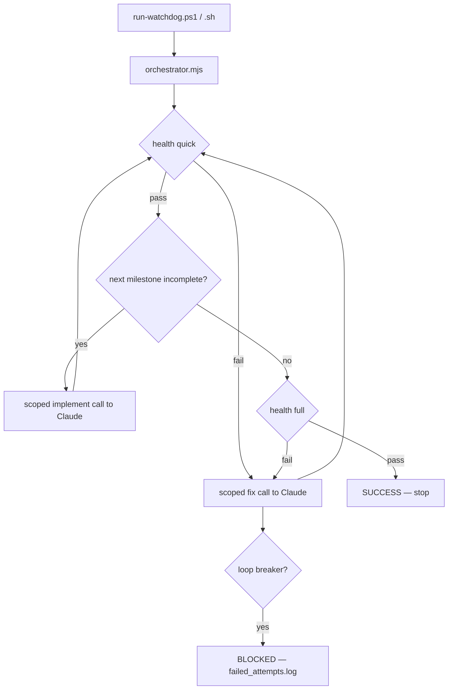

# Claude Local — Autonomous Watchdog for Claude Code CLI

Run **Claude Code CLI** autonomously on **local and small LLMs** (e.g. LM Studio, `qwopus3.5-9b-coder-mtp`) without infinite failure loops, repeated file re-reads, or runaway sessions.

The control loop lives in **deterministic Node code**, not in model judgment. Claude is called only for one small scoped task at a time (implement a milestone or fix a failing test), with a tight turn cap and hard stop conditions.

---

## Why this exists

Small local models often:

- re-read the same files many times
- repeat the same dead fix
- never decide when work is "done"
- spin until a human kills the session

This project separates **orchestration** (Node) from **execution** (Claude Code CLI). The orchestrator runs health checks, picks the next milestone, invokes the model briefly, and **stops safely** when progress stalls.

---

## How it works



| Layer | Role |
|-------|------|
| `project_description.md` | Your vision, milestones, and tuning knobs (YAML frontmatter) |
| `scripts/milestones.json` | Machine-checkable list of files per milestone ("done" detection) |
| `scripts/orchestrator/` | Deterministic engine: health, milestones, loop-breakers |
| `run-watchdog.ps1` / `.sh` | One-command launcher (Windows / Linux) |
| `watchdog.md` | Anti-loop rules (also enforced in code) |
| `CLAUDE.md` | Project memory loaded by Claude Code every session |

---

## Quick start

### Prerequisites

- [Node.js](https://nodejs.org) 18+
- [Claude Code CLI](https://code.claude.com) configured for your local model

### 1. Use this repo (or copy the kit into any folder)

Clone or copy these files into your project root.

### 2. Describe your project

Edit **`project_description.md`** (vision + milestones + config) and **`scripts/milestones.json`** (exact files each milestone must produce).

Example frontmatter knobs:

```yaml
impl_turns: 12          # max turns per milestone build
fix_turns: 8            # max turns per fix attempt
same_error_limit: 2     # stop after N identical error fingerprints
stall_limit: 2          # stop if model edits nothing but error persists
impl_attempt_limit: 3   # stop if a milestone gains no new files
max_iterations: 40      # hard ceiling on total loop cycles
```

**Tip for local models:** prefer **pure-logic modules** with Node tests (no DOM/browser). Put assertions inside `it()` / `test()` blocks, never directly in a `describe()` body.

### 3. Run

**Windows**

```powershell
.\run-watchdog.ps1
```

**Linux / macOS**

```bash
chmod +x run-watchdog.sh
./run-watchdog.sh
```

The orchestrator builds milestones one at a time, self-heals on test failures, and stops with **SUCCESS** when all milestones exist and `npm run health:full` is green.

---

## Launcher modes

| Command | What it does |
|---------|----------------|
| `run-watchdog.ps1` / `./run-watchdog.sh` | Autonomous: build + self-heal until done or blocked |
| `-Test` / `--test` | One health check only (verify setup) |
| `-Interactive` / `--interactive` | Open a normal interactive Claude Code session |

---

## Health checks

| Tier | Command | Runs |
|------|---------|------|
| Quick | `npm run health` | tests |
| Full (final gate) | `npm run health:full` | tests + `npm run build --if-present` |

Tests run through `scripts/run-tests.mjs`, a **robust gate** that fails even when `node --test` under-reports failures (e.g. assertions thrown inside a `describe()` body).

---

## Loop breakers (anti-spiral)

Enforced in code — the model does **not** decide when to stop:

| Trigger | Config key | Default |
|---------|------------|---------|
| Same error twice in a row | `same_error_limit` | 2 |
| Model edits no files, error persists | `stall_limit` | 2 |
| Milestone gains no new files | `impl_attempt_limit` | 3 |
| Total cycles exceeded | `max_iterations` | 40 |

On **BLOCKED**, the orchestrator writes `failed_attempts.log` with the last error tail. On **SUCCESS**, it deletes that file.

---

## Repository layout

```
.
├── CLAUDE.md                 # Claude Code project memory
├── watchdog.md               # Anti-loop behavioral rules
├── project_description.md    # YOUR spec + orchestrator config
├── package.json              # test / health scripts
├── run-watchdog.ps1          # Windows launcher
├── run-watchdog.sh           # Linux/macOS launcher
├── scripts/
│   ├── milestones.json       # YOUR machine-checkable milestones
│   ├── health-check.mjs      # quick / full tiers
│   ├── run-tests.mjs         # robust test gate
│   ├── parse-project-config.mjs
│   ├── orchestrator.mjs      # entry point
│   └── orchestrator/         # deterministic engine modules
├── tests/
│   └── scaffold.test.js      # keeps health green on a fresh project
└── .claude/skills/
    ├── loop/SKILL.md         # optional interactive /loop
    └── goal/SKILL.md         # optional interactive /goal
```

This repo also includes a worked example under `src/` and `tests/` (**MiniLedger** — a small accounting library built autonomously during kit validation).

---

## Interactive skills (optional)

For manual use inside Claude Code:

- `/loop` — run health checks on an interval and trigger fixes on failure
- `/goal` — scoped self-healing fixer with turn budget

The **recommended path for local models** is the deterministic orchestrator via `run-watchdog`, not model-managed looping.

---

## Example session output

```
[watchdog] Project: MiniLedger v0.1.0
[watchdog] Starting DETERMINISTIC orchestrator (autonomous) ...
[orch] iter 1: health GREEN; implement M1 (Money utilities)
[orch] iter 2: health GREEN; implement M2 (Account ledger)
[orch] iter 3: health GREEN; implement M3 (Category report)
[orch] iter 4: all milestones present and health:full GREEN
[orch] ===== SUCCESS: project complete and verified green =====
[watchdog] DONE: project complete and verified green.
```

---

## Contributing

Issues and PRs welcome. Keep orchestrator modules under 100 lines; run `npm test` before submitting.

---

## License

MIT
