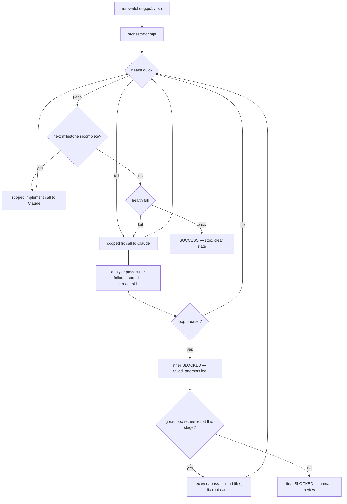

# Claude Local — Autonomous Watchdog for Claude Code CLI (v0.6.0)

Run **Claude Code CLI** autonomously on **local and small LLMs** (e.g. LM Studio) without infinite failure loops, repeated file re-reads, or runaway sessions.

The control loop lives in **deterministic Node code**, not in model judgment. Claude is called only for one small scoped task at a time (implement a milestone or fix a failing test), with a tight turn cap and hard stop conditions.

This kit contains **no application code** — only the engine, generic templates, and ready-to-copy sample specs under `samples/`.

---

## Why this exists

Small local models often:

- re-read the same files many times
- repeat the same dead fix
- never decide when work is "done"
- spin until a human kills the session

This project separates **orchestration** (Node) from **execution** (Claude Code CLI). The orchestrator runs health checks, picks the next milestone, invokes the model briefly, learns from failures, and **stops safely** when progress stalls.

---

## How it works



| Layer | Role |
|-------|------|
| `project_description.md` | Your vision, milestones, and tuning knobs (YAML frontmatter) |
| `scripts/milestones.json` | Machine-checkable list of files per milestone ("done" detection) |
| `scripts/orchestrator/` | Inner loop: health, milestones, active-milestone scope, loop-breakers |
| `scripts/orchestrator/great-loop.mjs` | Outer loop: recovery passes when inner BLOCKEDs (5× **per hang point**) |
| `scripts/orchestrator/journal.mjs` + `learn.mjs` | Learning: `failure_journal.log` + `learned_skills.log` |
| `run-watchdog.ps1` / `.sh` | One-command launcher (Windows / Linux) |
| `watchdog.md` | Anti-loop rules (also enforced in code) |
| `CLAUDE.md` | Project memory loaded by Claude Code every session |

---

## Quick start

### Prerequisites

- [Node.js](https://nodejs.org) 18+
- [Claude Code CLI](https://code.claude.com) configured for your local model

### 1. Extract the kit into an empty project folder

If you already have a `package.json`, merge the `test` / `health` / `health:full` scripts instead of overwriting.

### 2. Pick a starter spec

Copy a ready-made sample into your project root, or edit the template:

```bash
cp samples/text-stats/project_description.md ./project_description.md
cp samples/text-stats/milestones.json ./scripts/milestones.json
```

| Sample | Description | Milestones |
|--------|-------------|------------|
| `miniledger/` | In-memory accounting (integer cents) | 3 |
| `abs-brake-simulator/` | ABS physics + telemetry (pure logic) | 4 |
| `text-stats/` | Word/line statistics library | 3 |
| `unit-converter/` | Temperature & length converters | 3 |

All samples use `"mode": "pure-logic"`. See `samples/README.md`.

Example frontmatter knobs:

```yaml
impl_turns: 12          # max turns per milestone build
fix_turns: 8            # max turns per fix attempt
same_error_limit: 2     # stop after N identical error fingerprints
stall_limit: 2          # stop if model edits nothing but error persists
impl_attempt_limit: 3   # stop if a milestone gains no new files
max_iterations: 40      # hard ceiling on total loop cycles
great_loop_retries: 5   # max consecutive hangs at the SAME stage (resets on progress)
recovery_turns: 20      # turn budget per recovery pass (broader than fix_turns)
analyze_turns: 8        # turn budget for the post-failure analyze pass
```

**Tip for local models:** prefer **pure-logic modules** with Node tests (no DOM/browser). Put assertions inside `it()` / `test()` blocks, never directly in a `describe()` body.

### 3. Run

**Windows**

```powershell
.\run-watchdog.ps1
```

**Linux / macOS**

```bash
chmod +x run-watchdog.sh
./run-watchdog.sh
```

The orchestrator builds milestones one at a time, self-heals on test failures, and stops with **SUCCESS** when all milestones exist and `npm run health:full` is green.

---

## Launcher modes

| Command | What it does |
|---------|----------------|
| `run-watchdog.ps1` / `./run-watchdog.sh` | Autonomous: build + self-heal until done or blocked |
| `-Test` / `--test` | One health check only (verify setup) |
| `-Interactive` / `--interactive` | Open a normal interactive Claude Code session |

---

## Health checks

| Tier | Command | Runs |
|------|---------|------|
| Quick | `npm run health` | tests |
| Full (final gate) | `npm run health:full` | tests + `npm run build --if-present` |

Tests run through `scripts/run-tests.mjs`, a **robust gate** that fails even when `node --test` under-reports failures (e.g. assertions thrown inside a `describe()` body).

---

## Loop breakers (anti-spiral)

Enforced in code — the model does **not** decide when to stop:

| Trigger | Config key | Default |
|---------|------------|---------|
| Same error twice in a row | `same_error_limit` | 2 |
| Model edits no files, error persists | `stall_limit` | 2 |
| Milestone gains no new files | `impl_attempt_limit` | 3 |
| Total cycles exceeded | `max_iterations` | 40 |

On **BLOCKED**, the orchestrator writes `failed_attempts.log` with the last error tail. On **SUCCESS**, it deletes all state files.

---

## Great loop + learning (v0.6)

When the inner loop BLOCKEDs at a stage, a **recovery pass** runs (`recovery_turns: 20`, broader scope: read source + tests, fix root cause). The retry counter is **per hang point** — it resets when the inner loop makes progress (health green / next milestone), so every stage gets its own `great_loop_retries` attempts.

After each failed fix or recovery, an **analyze pass** (`analyze_turns: 8`) writes two learning files, read before the next attempt:

| File | Purpose |
|------|---------|
| `failure_journal.log` | What failed + model-written `root_cause` / `do_not_repeat` |
| `learned_skills.log` | Reusable patterns for later milestones |

All state files (`failed_attempts.log`, `recovery_attempts.log`, `failure_journal.log`, `learned_skills.log`) are gitignored and cleared on SUCCESS.

---

## Kit layout

```
.
├── CLAUDE.md                 # Claude Code project memory
├── watchdog.md               # Anti-loop behavioral rules
├── project_description.md    # TEMPLATE: your spec + orchestrator config
├── KIT_UPDATE_LOG.md         # Changelog between zip releases
├── package.json              # test / health scripts
├── run-watchdog.ps1          # Windows launcher
├── run-watchdog.sh           # Linux/macOS launcher
├── samples/                  # Ready-to-copy specs (miniledger, abs-brake-simulator, text-stats, unit-converter)
├── scripts/
│   ├── milestones.json       # TEMPLATE: machine-checkable milestones
│   ├── health-check.mjs      # quick / full tiers
│   ├── run-tests.mjs         # robust test gate
│   ├── parse-project-config.mjs
│   ├── orchestrator.mjs      # entry point
│   └── orchestrator/         # 15 deterministic engine modules
├── tests/
│   ├── scaffold.test.js      # keeps health green on a fresh project
│   └── test-utils.js         # approximateEqual (Node assert has no float compare)
└── .claude/skills/
    ├── loop/SKILL.md         # optional interactive /loop
    └── goal/SKILL.md         # optional interactive /goal
```

---

## Interactive skills (optional)

For manual use inside Claude Code:

- `/loop` — run health checks on an interval and trigger fixes on failure
- `/goal` — scoped self-healing fixer with turn budget

The **recommended path for local models** is the deterministic orchestrator via `run-watchdog`, not model-managed looping.

---

## Example session output

```
[watchdog] Project: TextStats v0.1.0
[watchdog] Starting DETERMINISTIC orchestrator (autonomous) ...
[orch] iter 1: health GREEN; implement M1 (Tokenizer)
[orch] iter 2: health GREEN; implement M2 (Word/line counts)
[orch] iter 3: health GREEN; implement M3 (Frequency report)
[orch] iter 4: all milestones present and health:full GREEN
[orch] ===== SUCCESS: project complete and verified green =====
[watchdog] DONE: project complete and verified green.
```

---

## Troubleshooting (local models)

| Symptom | Kit-level fix |
|---------|----------------|
| `assert.approximateEqual is not a function` | Use `tests/test-utils.js`; prompts and `hints.mjs` steer the model |
| Tests pass in IDE but health fails | `run-tests.mjs` catches describe-body assertions and false greens |
| Same error twice, then STOP | Inner loop-breaker — great loop triggers a recovery pass |
| Recovery passes exhausted | Read `recovery_attempts.log` + `failure_journal.log`; fix manually or trim scope |
| Model never finishes UI milestones | Split pure-logic milestones first; defer DOM/canvas to a later phase |

Kit changes propagate to **all future projects** when you re-extract the starter files. See `KIT_UPDATE_LOG.md` for what changed between releases.

---

## License

MIT
